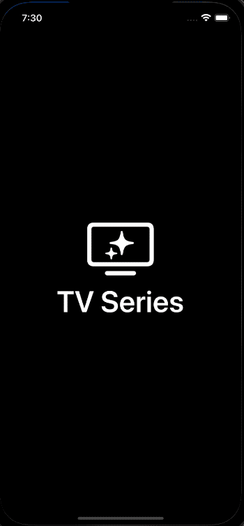

## Name
TV Series.

## Description
Test project written in Swift, using MVVM and Combine.

## Running

Clone this project, start Xcode and run on simulator.

## Features:
  - MVVM design pattern;
  - Reactive programming with Combine;
  - Programmatic views;
  - API consume with [TVmaze](https://www.tvmaze.com/api);

